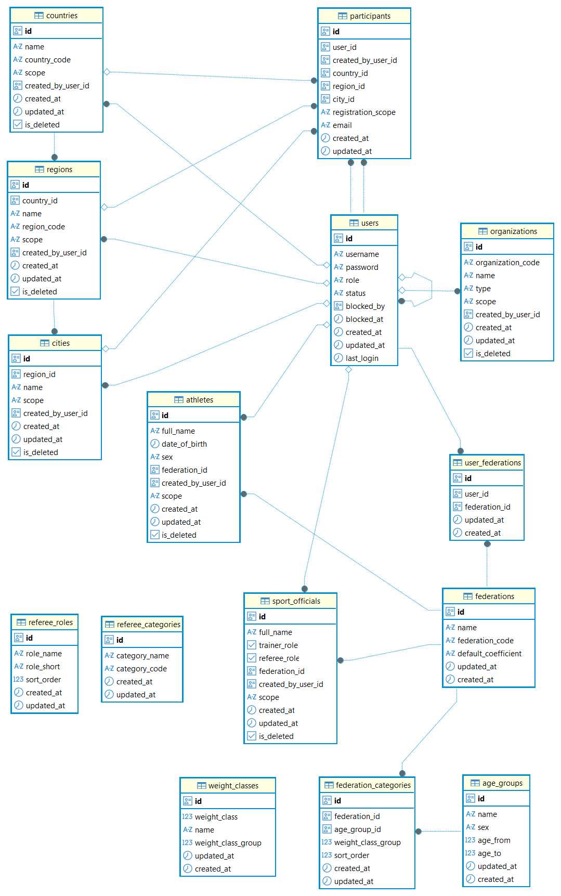

### Database Schema
The project uses `PostgreSQL` with `Prisma` ORM.  
Database migrations are managed by `Prisma` Migrate.

#### ER Diagram

#### Database Structure
➡ [Reference Tables](database/reference.md)  
- Static Reference Tables  
  - federations
  - age_groups
  - weight_classes
  - federation_categories
  - referee_categories
  - referee_roles  
- User Reference Tables
  - countries
  - regions
  - cities
  - organizations
  - athletes
  - sport_officials

➡ [Configuration Tables](database/configuration.md)  
- competition_age_groups
- user_federations
- nomination_status
- competition_sessions
- groups_in_session
- weight_classes_in_group
- referee_competition
- referee_competition_roles

➡ [Business Data Tables (User Data)](database/user.md)  
- users
- participants

➡ [Business Data Tables (Competition Data)](database/competition.md) 
- competitions
- athlete_registrations
- competition_organizations

➡ [Competition Runtime Tables](database/competition_runtime.md)  
- athlete_lifts
- competition_results

➡ [Calculated Tables](database/calculated.md)  
- organization_results

➡ [System Runtime Tables](database/system_runtime.md) 
- device_status
- global_state

➡ [Frontend Tables](database/frontend.md)
