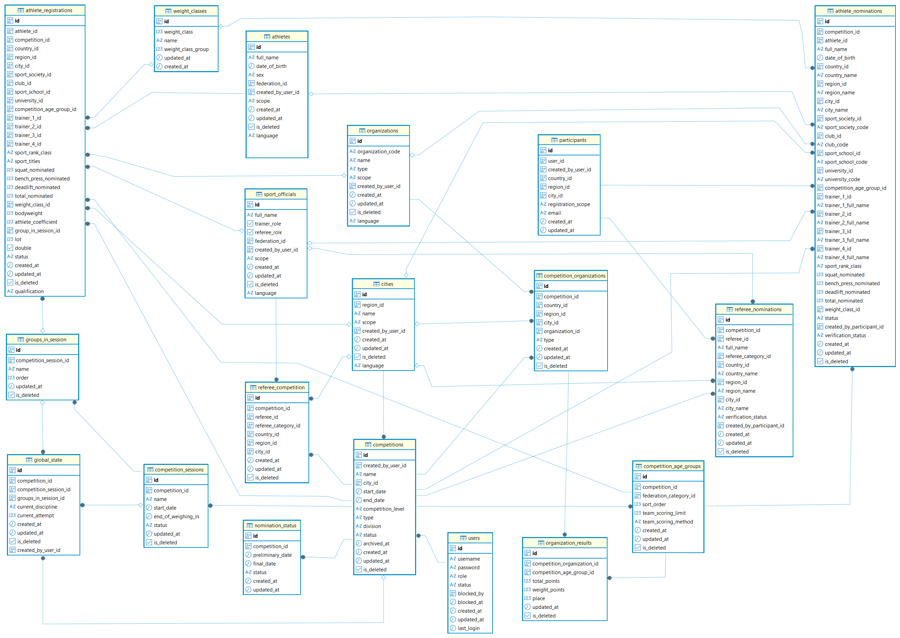

### Business Data Tables
#### Competition Data Tables

Contents
  

- [competitions](#competitions)
  - [CompetitionLevel enum](#competitionlevel-enum)
  - [CompetitionType enum](#competitiontype-enum)
  - [CompetitionDivision enum](#competitiondivision-enum)
  - [CompetitionStatus enum](#competitionstatus-enum)
- [athlete_registrations](#athlete_registrations)
  - [AthleteRegistrationStatus enum](#athleteregistrationstatus)
  - [AthleteQualification enum](#athletequalification)
- [athlete_nominations](#athlete_nominations)
  - [VerificationStatus enum](#verificationstatus)
- [competition_organizations](#competition_organizations)
  - [CompetitionOrganizationType enum](#competitionorganizationtype-enum)

[ER Diagram](#er-diagram)

---

### competitions
Stores competition events created by `USER`.  
Each competition belongs to a city (region, country) and is associated with a predefined competition age group.  
The competition configuration defines the competition level, discipline, division, and current status.  

| Field | Description |
|------|-------------|
| id | Unique competition identifier |
| created_by_user_id | User who created and manages the competition |
| name | Competition name |
| city_id | Competition location |
| start_date | Competition start date |
| end_date | Competition end date |
| competition_level | Competition level (`CompetitionLevel` enum) |
| type | Competition discipline (`CompetitionType` enum) |
| division | Equipment division (`CompetitionDivision` enum) |
| status | Competition status (`CompetitionStatus` enum) |
| archived_at | Archive timestamp |
| created_at | Record creation timestamp |
| updated_at | Record update timestamp |
| is_deleted | Soft delete flag |

#### CompetitionLevel enum
Defines the competition level.

| Value | Description |
|--------|-------------|
| INTERNATIONAL | International competition. |
| NATIONAL | National competition. |
| REGIONAL_OPEN | Regional competition open to participants from any region. |
| REGIONAL_ONLY | Regional competition restricted to participants from the selected region. |
| LOCAL_OPEN | Local competition open to participants from any location. |
| LOCAL_ONLY | Local competition restricted to participants from the selected city. |

#### CompetitionType enum
Defines the competition discipline.

| Value | Description |
|--------|-------------|
| POWERLIFT | Full powerlifting competition (Squat, Bench Press, Deadlift). |
| BENCH_PRESS | Bench Press competition only. |

#### CompetitionDivision enum
Defines the equipment division.

| Value | Description |
|--------|-------------|
| CLASSIC | Classic (raw) division. |
| EQUIPPED | Equipped division. |

#### CompetitionStatus enum
Defines the current competition status.

| Value | Description |
|--------|-------------|
| ACTIVE | Competition is active and available for management. |
| ARCHIVED | Competition has been archived and is no longer active. |

#### Relations
* related with ➡ [**users**](user.md) by `created_by_user_id`
* related with ➡ [**cities**](reference.md#cities) by `city_id`
* related with [сompetition_age_groups](configuration.md#сompetition_age_groups)
* related with [referee_competition](configuration.md#referee_competition)
* related with [referee_nominations](configuration.md#referee_nominations)
* related with [nomination_status](configuration.md#nomination_status)
* related with [competition_sessions](configuration.md#competition_sessions)
* related with [athlete_registrations](#athlete_registrations)
* related with [athlete_nominations](#athlete_nominations)
* related with [competition_organizations](#competition_organizations)
* related with [global_state](system_runtime.md#global_state)

#### Business Rules
- Each competition is created and managed by a single `USER`.
- The competition location is defined by the selected **city (region, country)**
- A competition may contain one or more age groups.
- Soft deletion is supported through the `is_deleted` flag.

#### Competition Creation Workflow
- The `USER` selects one federation.
- The `USER` selects one or more federation age groups. These are required fields.
- The application looks up the corresponding record in [federation_categories](reference.md#federation_categories) table
- When a competition is created, the system creates a record in `сompetitions` and one or more corresponding records in [сompetition_age_groups](configuration.md#сompetition_age_groups).
- Each `сompetition_age_groups` record defines a competition category and stores its team scoring settings (`team_scoring_limit` and `team_scoring_method`).

---

### athlete_registrations
Stores athlete registrations for competitions.  
Each record contains the athlete's competition entry, nomination attempts, competition category, represented organizations, assigned trainers, weigh-in information, session assignment, and registration status.

| Column | Description |
|--------|-------------|
| id | Unique registration identifier |
| athlete_id | Registered athlete |
| competition_id | Competition |
| country_id | Country represented by the athlete (optional) |
| region_id | Region represented by the athlete (optional) |
| city_id | City represented by the athlete (optional) |
| sport_society_id | Sport society represented by the athlete (optional) |
| club_id | Club represented by the athlete (optional) |
| sport_school_id | Sport school represented by the athlete (optional) |
| university_id | University represented by the athlete (optional) |
| competition_age_group_id | Competition age group |
| trainer_1_id | Primary trainer (optional) |
| trainer_2_id | Additional trainer (optional) |
| trainer_3_id | Additional trainer (optional) |
| trainer_4_id | Additional trainer (optional) |
| sport_rank_class | Athlete's sport rank or class |
| sport_titles | Athlete's sport titles |
| squat_nominated | Nominated squat weight |
| bench_press_nominated | Nominated bench press weight |
| deadlift_nominated | Nominated deadlift weight |
| total_nominated | Total nominated weight |
| weight_class_id | Assigned weight class (optional) |
| bodyweight | Official bodyweight after weigh-in (optional) |
| athlete_coefficient | Calculated competition coefficient |
| group_in_session_id | Assigned competition group (optional) |
| lot | Lot number |
| double | Indicates participation outside the main classification |
| status | Participation status (`AthleteRegistrationStatus` enum) |
| qualification | Defines the athlete's qualification status (`AthleteQualification` enum) |
| created_at | Record creation timestamp |
| updated_at | Record update timestamp |
| is_deleted | Soft delete flag |

#### AthleteRegistrationStatus
Defines the athlete's participation status in a competition.

| Value | Description |
|--------|-------------|
| TEAM | The athlete competes as a member of a team. |
| PERSONALLY | The athlete competes individually. |
| OUT_OF_COMP | The athlete competes outside the official competition standings. |

#### AthleteQualification

Defines the athlete's qualification status during the competition.

| Value          | Description                                                                                                   |
| -------------- | ------------------------------------------------------------------------------------------------------------- |
| QUALIFIED      | The athlete is qualified to continue participating in the competition.                                        |
| WITHDRAWN      | The athlete has withdrawn from the competition, for example due to a `medical decision`.                        |
| DISQUALIFIED   | The athlete has been disqualified from the competition due to a rule violation or other disqualifying reason. |

#### Relations
- related with [**athletes**](reference.md#athletes) by `athlete_id`
- related with [**competitions**](#competitions) by `competition_id`
- related with [**countries**](reference.md#countries) by `country_id`
- related with [**regions**](reference.md#regions) by `region_id`
- related with [**cities**](reference.md#cities) by `city_id`
- related with [**organizations**](reference.md#organizations) by `sport_society_id`
- related with **organizations** by `club_id`
- related with **organizations** by `sport_school_id`
- related with **organizations** by `university_id`
- related with [**competition_age_groups**](configuration.md#competition_age_groups) by `competition_age_group_id`
- related with [**sport_officials**](reference.md#sport_officials) by `trainer_1_id`
- related with **sport_officials** by `trainer_2_id`
- related with **sport_officials** by `trainer_3_id`
- related with **sport_officials** by `trainer_4_id`
- related with [**weight_classes**](reference.md#weight_classes) by `weight_class_id`
- related with [**groups_in_session**](configuration.md#groups_in_session) by `group_in_session_id`

#### Business Rules
- An athlete may be registered for the same competition only once within the same competition age group.
- Registration may include the athlete's represented country, region, city, and organizations.
- Up to four trainers may be assigned.
- The competition age group determines the available weight classes.
- Weight class and bodyweight may be assigned after weigh-in.
- A competition group and lot number may be assigned after registration.
- Online registrations are created with the `PENDING` verification status.
- Registrations created directly by a USER are automatically assigned the `APPROVED` status.
- Athletes with the `REJECTED` verification status are automatically removed after the nomination period closes.
- If both the `AthleteRegistrations` and `Athletes` records were created at the same time during online registration, both records are removed automatically.

---

### athlete_nominations
Stores online athlete applications for participation in a competition before they are reviewed and approved by the competition organizer.

A nomination may reference an existing athlete using athlete_id, or contain athlete information directly if the athlete does not yet exist in the database. The same approach is used for countries, regions, cities, organizations, and trainers.

After approval, the nomination can be used to create an athlete_registrations record.

|Column	|Type	|NULL	|Description|
|------|------|-----|-----------|
| id	|UUID	|No	|Unique nomination identifier|
| competition_id	|UUID	|No	|Competition for which the nomination was submitted|
| athlete_id	|UUID	|Yes	|Existing athlete identifier|
| full_name	|TEXT	|Yes	|Athlete's full name submitted in the nomination|
| date_of_birth	|TIMESTAMP	|Yes	|Athlete's date of birth|
| country_id	|UUID	|Yes	|Existing country identifier|
| country_name	|TEXT	|Yes	|Country name submitted in the nomination|
| region_id	|UUID	|Yes	|Existing region identifier|
| region_name	|TEXT	|Yes	|Region name submitted in the nomination|
| city_id	|UUID	|Yes	|Existing city identifier|
| city_name	|TEXT	|Yes	|City name submitted in the nomination|
| sport_society_id	|UUID	|Yes	|Existing sport society identifier|
| sport_society_code	|TEXT	|Yes	|Sport society code|
| club_id	|UUID	|Yes	|Existing club identifier|
| club_code	|TEXT	|Yes	|Club code|
| sport_school_id	|UUID	|Yes	|Existing sport school identifier|
| sport_school_code	|TEXT	|Yes	|Sport school code|
| university_id	|UUID	|Yes	|Existing university identifier|
| university_code	|TEXT	|Yes	|University code|
| competition_age_group_id	|UUID	|No	|Competition age group and sex category|
| trainer_1_id	|UUID	|Yes	|Existing first trainer identifier|
| trainer_1_full_name	|TEXT	|Yes	|First trainer's full name|
| trainer_2_id	|UUID	|Yes	|Existing second trainer identifier|
| trainer_2_full_name	|TEXT	|Yes	|Second trainer's full name|
| trainer_3_id	|UUID	|Yes	|Existing third trainer identifier|
| trainer_3_full_name	|TEXT	|Yes	|Third trainer's full name|
| trainer_4_id	|UUID	|Yes	|Existing fourth trainer identifier|
| trainer_4_full_name	|TEXT	|Yes	|Fourth trainer's full name|
| sport_rank_class	|TEXT	|Yes	|Athlete's sport rank/class|
| squat_nominated	|DECIMAL(4,1)	|Yes	|Nominated squat weight|
| bench_press_nominated	|DECIMAL(4,1)	|Yes	|Nominated bench press weight|
| deadlift_nominated	|DECIMAL(4,1)	|Yes	|Nominated deadlift weight|
| total_nominated	|DECIMAL(5,1)	|Yes	|Nominated total|
| weight_class_id	|UUID	|Yes	|Weight class in which the athlete is registered|
| status	|AthleteRegistrationStatus	|No	|Athlete registration type|
| created_by_participant_id	|UUID	|No	|Participant who submitted the nomination|
| verification_status	|VerificationStatus	|No	|Nomination verification status|
| created_at	|TIMESTAMP	|No	|Creation timestamp|
| updated_at	|TIMESTAMP	|No	|Last update timestamp|
| is_deleted	|BOOLEAN	|No	|Indicates whether the nomination has been logically deleted|

### Relations

* related with ➡ [**competitions**](#competitions) by `competition_id`
* related with ➡ [**athletes**](reference.md#athletes) by `athlete_id`
* related with ➡ [**countries**](reference.md#countries) by `country_id`
* related with ➡ [**regions**](reference.md#regions) by `region_id`
* related with ➡ [**cities**](reference.md#cities) by `city_id`
* related with ➡ [**organizations**](reference.md#organizations) by `sport_society_id`, `club_id`, `sport_school_id`, `university_id`
* related with ➡ [**competition_age_groups**](configuration.md#competition_age_groups) by `competition_age_group_id`
* related with ➡ [**sport_officials**](reference.md#sport_officials) by `trainer_1_id`,`trainer_2_id`, `trainer_3_id`, `trainer_4_id`
* related with ➡ [**weight_classes**](reference.md#weight_classes) by `weight_class_id`
* related with ➡ [**participants**](user.md#participants) by `created_by_participant_id`

#### VerificationStatus
Defines the verification status of a referee assignment.

| Value | Description |
|--------|-------------|
| PENDING | Verification has not yet been completed. |
| APPROVED | The referee assignment has been verified and approved. |
| REJECTED | The referee assignment has been rejected. |

---

### competition_organizations
Stores the organizations represented in a competition.  
This table is generated automatically from `AthleteRegistrations` and contains unique combinations of organization and its territorial affiliation within a competition.

| Column | Description |
|--------|-------------|
| id | Unique record identifier |
| competition_id | Competition |
| country_id | Country (optional) |
| region_id | Region (optional) |
| city_id | City (optional) |
| organization_id | Organization (optional) |
| type | Record type (`CompetitionOrganizationType` enum) |
| created_at | Record creation timestamp |
| updated_at | Record update timestamp |
| is_deleted | Soft delete flag |

#### CompetitionOrganizationType enum
Defines the type of competition organization record.

| Value | Populated field |
|--------|-----------------|
| COUNTRY | `country_id` |
| REGION | `country_id`, `region_id` |
| CITY | `country_id`, `region_id`, `city_id` |
| SPORT_SCHOOL | `organization_id` (Sport School) |
| CLUB | `organization_id` (Club) |
| UNIVERSITY | `organization_id` (University) |
| SPORT_SOCIETY | `organization_id` (Sport Society) |

#### Relations
* related with [**competitions**](#competitions) by `competition_id`
* related with [**countries**](reference.md#countries) by `country_id`
* related with [**regions**](reference.md#regions) by `region_id`
* related with [**cities**](reference.md#cities) by `city_id`
* related with [**organizations**](reference.md#organizations) by `organization_id`
* related with [**organization_results**](calculated.md)

#### Business Rules
- Generated automatically from `AthleteRegistrations`.
- Stores unique organizations represented in a competition.
- Each record represents exactly one territorial or organizational entity.
- The populated reference fields depend on the value of `type`:
  - `COUNTRY` → only `country_id` is populated.
  - `REGION` → `country_id` and `region_id` are populated.
  - `CITY` → `country_id`, `region_id`, and `city_id` are populated.
  - `SPORT_SCHOOL`, `CLUB`, `UNIVERSITY`, `SPORT_SOCIETY` → only `organization_id` is populated.
- All unused reference fields must be `NULL`.
- The table stores only unique records within a competition.
- The table is rebuilt using the `DELETE + INSERT INTO` strategy.

---

### ER Diagram
- competitions
- athlete_registrations
- athlete_nominations
- competition_organizations

---
