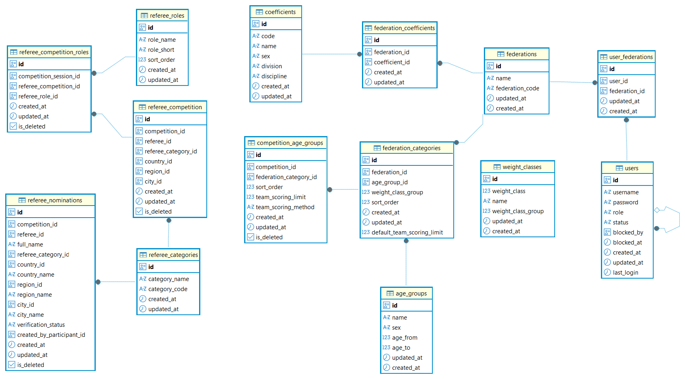
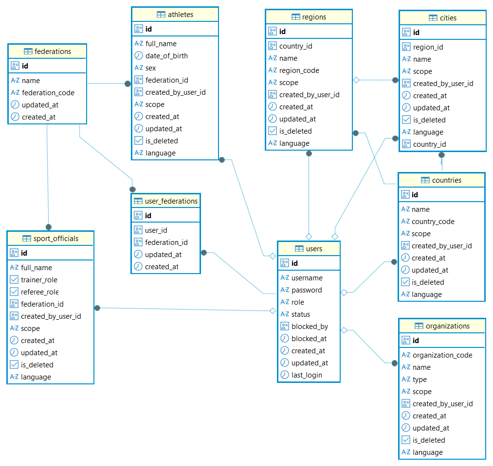

### Reference Tables

Contents
  

- [Static Reference Tables](#static-reference-tables)
- [User Reference Tables](#user-reference-tables)

  

---

### Static Reference Tables 

Contents
  

- [federations](#federations)
- [coefficients](#coefficients)
  - [Sex enum](#sex-enum)
  - [CoefficientDivision enum](#coefficientdivision-enum)
  - [CoefficientDiscipline enum](#coefficientdiscipline-enum)
- [federation_coefficients](#federation_coefficients)
- [age_groups](#age_groups)
- [weight_classes](#weight_classes)
- [federation_categories](#federation_categories)
- [user_federations](#user_federations)
- [referee_categories](#referee_categories)
- [referee_roles](#referee_roles)

[Static Reference ER Diagram](#static-reference-er-diagram)

  

**Populated and modified by `ADMIN` only**

---

### federations
Stores powerlifting federation information.

| Field | Type | Description |
|------|------|-------------|
| id | UUID | Primary key generated automatically |
| name | String | Federation name |
| federation_code | String | Unique federation identifier |
| created_at | DateTime | Automatically created timestamp |
| updated_at | DateTime | Automatically updated timestamp |

#### Relations
- related with [**federation_coefficients**](#federation_coefficients)
- related with [**federation_categories**](#federation_categories)
- related with [**athletes**](#athletes)
- related with [**sport_officials**](#sport_officials)
- related with [**user_federations**](configuration.md#user_federations)

---

### coefficients
Acts as a global dictionary containing all valid powerlifting scoring variants.  
Each formula's variant is isolated by sex, athletic discipline, and protective equipment setup.

| Column | Type | Description |
|--------|------|-------------|
| id | UUID | Unique identifier for the specific coefficient variant. |
| code | TEXT | Standardized uppercase lookup code. |
| name | TEXT | Human-readable title displayed in the UI. |
| sex | ENUM | Biological sex constraint required by all formulas. |
| division | ENUM | Lifting equipment layer rules (Raw vs Equipped). |
| discipline | ENUM | Competition discipline. |
| created_at | DateTime | Automatically created timestamp |
| updated_at | DateTime | Automatically updated timestamp |

#### Sex enum
Defines the biological sex of the athlete. This is a foundational constraint required by 100% of powerlifting formulas, as calculation curves differ significantly between men and women.
- `MEN`
- `WOMEN`

#### CoefficientDivision enum
Specifies the lifting equipment category rules. This is critical for some systems, which utilize completely different mathematical models depending on whether protective gear is used.

| Value | Description |
|--------|-------------|
| CLASSIC | Classic (raw) division. |
| EQUIPPED | Equipped division. |
| ANY | Used for universal formulas where the equipment type does not alter the mathematical equation. |

#### CoefficientDiscipline enum
Defines the competition discipline.

| Value | Description |
|--------|-------------|
| POWERLIFT | Full powerlifting competition (Squat, Bench Press, Deadlift). |
| BENCH_PRESS | Bench Press competition only. |
| ANY | Used as a wildcard for formulas that apply uniformly across all lifting disciplines. |

#### Relations
- related with [**federation_coefficients**](#federation_coefficients)

---

### federation_coefficients
A strict junction table handling the `Many-to-Many` routing matrix between federations and active formulas.

| Column | Type | Description |
|--------|------|-------------|
| id | UUID | Junction record unique tracking identifier. |
| federation_id | UUID | Linked federation ID.|
| coefficient_id | UUID | Linked coefficient system variant ID. |
| created_at | DateTime | Automatically created timestamp |
| updated_at | DateTime | Automatically updated timestamp |

#### Relations
- related with [**federations**](#federations)
- related with [**coefficients**](#coefficients)

---

### age_groups
Stores age categories used in competitions.  

Contains a list of available age groups defined by `name` and `sex`.

| Field | Type | Description |
|------|------|-------------|
| id | UUID | Primary key generated automatically |
| name | String | Age group display name |
| sex | Enum | Gender category |
| age_from | Integer | Minimum allowed age |
| age_to | Integer | Maximum allowed age |
| created_at | DateTime | Automatically created timestamp |
| updated_at | DateTime | Automatically updated timestamp |

The `sex` field supports:
- `MEN`
- `WOMEN`

#### Example
| name | sex |
|------|------|
| open | MEN |
| open | WOMEN |
| junior | MEN |

#### Relations
- related with [**federation_categories**](#federation_categories)

---

### weight_classes
Stores weight categories used in competitions.  

Weight classes are grouped by `weight_class_group`.

| Field | Type | Description |
|------|------|-------------|
| id | UUID | Primary key generated automatically |
| weight_class | Integer | Weight category identifier |
| name | String | Display name |
| weight_class_group | Integer | Group identifier used by a list of categories |
| created_at | DateTime | Automatically created timestamp |
| updated_at | DateTime | Automatically updated timestamp |

The combination of `weight_class_group` and `weight_class` must be **unique**.

#### Example
| weight_class | weight_class_group |
|------|------|
| 56 | 2 |
| 60 | 2 |
| 67 | 2 |
| 48 | 3 |
| 52 | 3 |
| 56 | 3 |

#### Relations
- related with [**federation_categories**](#federation_categories) by `weight_class_group` field (indirect relationship).
- related with [**weight_classes_in_group**](configuration.md#weight_classes_in_group)
- related with [**athlete_registrations**](competition.md#athlete_registrations)
- related with [**athlete_nominations**](competition.md#athlete_nominations)

---

### federation_categories
Cross-Reference Table.  
- Defines competition categories available for each federation.  
- Connects federations data with age groups and defines which weight class group should be used. 
- Stores the `default_team_scoring` configuration used when creating competitions.

Separates:
- `federations` (FK)
- `age groups` (FK)
- `weight class` - `weight_class_group`

| Field | Type | Description |
|------|------|-------------|
| id | UUID | Primary key |
| federation_id | UUID | Reference to `federations` |
| age_group_id | UUID | Reference to `age_groups` |
| weight_class_group | Integer | [weight_classes](#weight_classes) group **identifier** |
| sort_order | Integer | Display order |
| default_team_scoring | Integer | Default team scoring configuration |
| created_at | DateTime | Automatically created timestamp |
| updated_at | DateTime | Automatically updated timestamp |

### Relations
- related with - [federations](#federations) by `federation_id`
- related with - [age_groups](#age_groups) by `age_group_id`
- related with ➡ [**competition_age_groups**](configuration.md#competition_age_groups)

---

### user_federations
Defines which federations are accessible to each user.
This table maps users to the federations they are allowed to work with.

**Fields**
- `id` UUID
- `user_id` UUID
- `federation_id` UUID
- `updated_at`DateTime
- `created_at` DateTime

#### Relations
- related with ➡ [**federations**](#federations) by `federation_id`
- related with ➡ [**user**](user.md#users) by `created_by_user_id`

#### Business Rules
- A `USER` may have access to one or more federations.
- Access to federations is assigned by `ADMIN` users.
- Users can work only with federations assigned to them.
- The combination of `user_id` and `federation_id` must be `unique`.

---

### referee_categories
Stores the list of referee qualification categories.  
This is a reference table used by referee-related entities.

**Fields**
- `id` UUID
- `category_name` String
- `category_code` String
- `created_at` DateTime
- `updated_at` DateTime

related with [referee_competition](configuration.md#referee_competition)  
related with [referee_nominations](configuration.md#referee_nominations)

---

### referee_roles
Stores the list of referee roles used during competitions.  
The `sort_order` field defines the display order.  
This is a reference table used by referee-related entities.

**Fields**
- `id` UUID
- `role_name` String
- `role_short` String
- `sort_order` Int
- `created_at` DateTime
- `updated_at` DateTime

related with [referee_competition_roles](configuration.md#referee_competition_roles)

---

### Static Reference ER Diagram
- federations
- coefficients
- federation_coefficients
- age_groups
- weight_classes
- federation_categories
- user_federations
- referee_categories
- referee_roles

---

### User Reference Tables

Contents
  

- [countries](#countries)
- [regions](#regions)
- [cities](#cities)
- [organizations](#organizations)
  - [OrganizationType enum](#organizationtype)
- [athletes](#athletes)
  - [AthleteSex enum](#athletesex-enum)
- [sport_officials](#sport_officials)
  - [DataScope enum](#datascope-enum)
  - [Language Enum](#language-enum)

[User Reference ER Diagram](#user-reference-er-diagram)

  

---

### countries
Stores the list of countries available in the system.  

**Fields**
- `id` UUID
- `name` String
- `country_code` `String?`
- `scope` ENUM [DataScope](#datascope-enum)
- `language` ENUM [Language](#language-enum)
- `created_by_user_id` String?
- `created_at` DateTime
- `updated_at` DateTime
- `is_deleted` Boolean

Defines the ownership scope of reference data using the [**DataScope**](#datascope-enum) enum.  
Defines the language context used for record lookup and data entry using the [**Language**](#language-enum) enum.

#### Relations
- related with ➡ [**users**](user.md#users) by `created_by_user_id`
- related with [regions](#regions)
- related with [participants](user.md#participants)
- related with [referee_competition](configuration.md#referee_competition)
- related with [referee_nominations](configuration.md#referee_nominations)
- related with [athlete_registrations](competition.md#athlete_registrations)
- related with [athlete_nominations](competition.md#athlete_nominations)
- related with [competition_organizations](competition.md#competition_organizations)

Soft deletion is supported through the `is_deleted` flag.

---

### regions
Stores administrative regions belonging to a country.  

**Fields**
- `id` UUID
- `country_id` String
- `name` String
- `region_code` String?
- `scope` ENUM [DataScope](#datascope-enum)
- `language` ENUM [Language](#language-enum)
- `created_by_user_id` String?
- `created_at` DateTime
- `updated_at` DateTime
- `is_deleted` Boolean

Defines the ownership scope of reference data using the [**DataScope**](#datascope-enum) enum.  
Defines the language context used for record lookup and data entry using the [**Language**](#language-enum) enum.

#### Relations
- related with [**countries**](#countries)
- related with ➡ [**users**](user.md#users) by `created_by_user_id`
- related with [cities](#cities)
- related with [participants](user.md#participants)
- related with [referee_competition](configuration.md#referee_competition)
- related with [referee_nominations](configuration.md#referee_nominations)
- related with [athlete_registrations](competition.md#athlete_registrations)
- related with [athlete_nominations](competition.md#athlete_nominations)
- related with [competition_organizations](competition.md#competition_organizations)

Soft deletion is supported through the `is_deleted` flag.

---

### cities
Stores cities belonging to a region.  
Defines the ownership scope of reference data using the [**DataScope**](#datascope-enum) enum.  
Defines the language context used for record lookup and data entry using the [**Language**](#language-enum) enum.

**Fields**
- `id` UUID
- `region_id` String
- `name` String
- `scope` ENUM [DataScope](#datascope-enum)
- `language` ENUM [Language](#language-enum)
- `created_by_user_id` String?
- `created_at` DateTime
- `updated_at` DateTime
- `is_deleted` Boolean

#### Relations
- related with [**regions**](#regions)
- related with ➡ [**users**](user.md#users) by `created_by_user_id`
- related with [participants](user.md#participants)
- related with [referee_competition](configuration.md#referee_competition)
- related with [referee_nominations](configuration.md#referee_nominations)
- related with [competitions](competition.md#competitions)
- related with [athlete_registrations](competition.md#athlete_registrations)
- related with [athlete_nominations](competition.md#athlete_nominations)
- related with [competition_organizations](competition.md#competition_organizations)

Soft deletion is supported through the `is_deleted` flag.

---

### organizations
Stores organizations that may be associated with athletes, competitions, or other entities within the system.

**Fields**
- `id` UUID
- `organization_code` String
- `name` String?
- `type` ENUM `OrganizationType`
- `scope` ENUM [DataScope](#datascope-enum)
- `language` ENUM [Language](#language-enum)
- `created_by_user_id` String?
- `created_at` DateTime
- `updated_at` DateTime
- `is_deleted` Boolean

Defines the ownership scope of reference data using the [**DataScope**](#datascope-enum) enum.  
Defines the language context used for record lookup and data entry using the [**Language**](#language-enum) enum.  
Defines supported organization types using the `OrganizationType` enum:
#### OrganizationType
- `SPORT_SCHOOL`
- `CLUB`
- `UNIVERSITY`
- `SPORT_SOCIETY`

#### Relations
- related with ➡ [**users**](user.md#users) by `created_by_user_id`
- related with [athlete_registrations](competition.md#athlete_registrations)
- related with [athlete_nominations](competition.md#athlete_nominations)
- related with [competition_organizations](competition.md#competition_organizations)

Soft deletion is supported through the `is_deleted` flag.

---

### athletes
Stores athlete records used for competition registration and athlete identification.  
Each athlete belongs to a specific federation through `federation_id`.  
The federation defines the visibility scope of athlete records.  

| Field | Description |
|---|---|
| id | Unique athlete identifier |
| full_name | Athlete full name |
| date_of_birth | Athlete date of birth |
| sex | Athlete sex (`AthleteSex` enum) |
| federation_id | Federation visibility scope |
| created_by_user_id | User who created the record |
| scope | Record ownership scope ([**DataScope**](#datascope-enum) enum) |
| language | Language stored for faster athlete lookup during data entry ([**Language**](#language-enum) enum) |
| created_at | Record creation timestamp |
| updated_at | Record update timestamp |
| is_deleted | Soft delete flag |

#### AthleteSex enum
- MAN
- WOMAN

#### Relations
- related with [**federations**](#federations) by `federation_id`
- related with ➡ [**users**](user.md#users) by `created_by_user_id`
- related with [athlete_registrations](competition.md#athlete_registrations)
- related with [athlete_nominations](competition.md#athlete_nominations)

#### Business Rules
- `federation_id` defines the visibility area of the athlete.
- The same athlete can exist in different federation visibility areas.
- `GLOBAL` athletes are visible to all users within the federation.
- For online registration, `created_by_user_id` is assigned to the registered `PARTICIPANT` user.
- `USER` and their associated `PARTICIPANT` can edit their own athlete records.
- `ADMIN` user can edit any athlete record.

---

### sport_officials
Stores sport officials participating in competitions.

**Fields**
- `id` UUID
- `full_name` String
- `trainer_role` Boolean
- `referee_role` Boolean
- `federation_id` String
- `scope` ENUM [DataScope](#datascope-enum)
- `language` ENUM [Language](#language-enum)
- `created_by_user_id` String?
- `created_at` DateTime
- `updated_at` DateTime
- `is_deleted` Boolean

Defines the ownership scope of reference data using the [**DataScope**](#datascope-enum) enum.  
Defines the language context used for record lookup and data entry using the [**Language**](#language-enum) enum.

A sport official may have one or both roles:
- Trainer (`trainer_role` Boolean)
- Referee (`referee_role` Boolean)

The federation defines the visibility scope of sport official records.  

#### Relations
- related with [**federations**](#federations) by `federation_id`
- related with ➡ [**users**](user.md#users) by `created_by_user_id`
- related with [referee_competition](configuration.md#referee_competition)
- related with [referee_nominations](configuration.md#referee_nominations)
- related with [athlete_registrations](competition.md#athlete_registrations)
- related with [athlete_nominations](competition.md#athlete_nominations)

#### Business Rules
- A sport official may be a trainer, a referee, or both.
- `federation_id` defines the visibility area of the record.
- The same sport official may exist in multiple federation visibility areas.
- `GLOBAL` records are visible to all users within the federation.
- For online registration, `created_by_user_id` is assigned to the registered `PARTICIPANT` user.
- `USER` and their associated `PARTICIPANT` may edit their own records.
- `ADMIN` users may edit any record.

---

#### DataScope Enum
The table supports two types of records:

- **`GLOBAL`** – system reference data maintained by administrators.
- **`USER`** – user-defined records created when the required country does not exist in the global list.

#### Business Rules

- `GLOBAL` records are system reference data and must have `created_by_user_id = NULL`.
- `USER` records are user-defined and must reference the user who created them through `created_by_user_id`.
- `GLOBAL` records may only be managed by `ADMIN` users.

---

#### Language Enum
Defines the user interface language.

| Value | Description |
|--------|-------------|
| EN | English |
| UK | Ukrainian |
| PL | Polish |

---

### User Reference ER Diagram
- countries
- regions
- cities
- organizations
- athletes
- sport_officials

---
