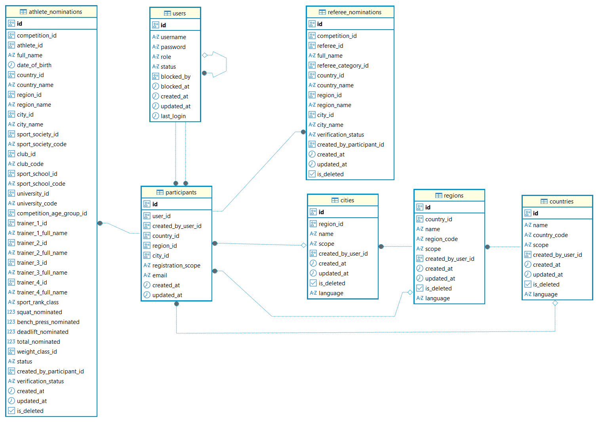

### Business Data Tables
#### User Data Tables

Contents
  

- [users](#users)
  - [UserRole enum](#userrole-enum)
  - [UserStatus enum](#userstatus-enum)
- [participants](#participants)
  - [RegistrationScope enum](#registrationscope-enum)
- [ER Diagram](#er-diagram)

---

### users

The `Users` table stores all system users and defines their access level and account status.

A user can have one of the following roles:

- `ADMIN` — full system access. Can manage users, competitions, reference data, and system settings.
- `USER` — regular system user. Has access only to assigned federations and can manage own data according to permissions.
- `PARTICIPANT` — user account created for online competition registration. Access is limited to data created by the related `USER` or `ADMIN`.

| Field | Description |
|---|---|
| `id` | UUID primary key |
| `username` | Unique username used for authentication |
| `password` | Hashed user password |
| `role` | User access role (`ADMIN`, `USER`, `PARTICIPANT`) |
| `status` | Account status (`ACTIVE`, `BLOCKED`) |
| `blocked_by` | Reference to the user who blocked this account |
| `blocked_at` | Date and time when the account was blocked |
| `created_at` | Account creation timestamp |
| `updated_at` | Last update timestamp |
| `last_login` | Last successful login timestamp |

- A user can block multiple users.
- A `PARTICIPANT` account is created and managed by a `USER` or `ADMIN`.

#### Relations
- `blocked_by` is a self-reference to the `Users` table.
- related with ➡ [**countries**](reference.md#countries) through records created by the user
- related with ➡ [**regions**](reference.md#regions) through records created by the user
- related with ➡ [**cities**](reference.md#cities) through records created by the user
- related with ➡ [**organizations**](reference.md#organizations) through records created by the user
- related with ➡ [**athletes**](reference.md#athletes) through records created by the user
- related with ➡ [**sport_officials**](reference.md#sport_officials) through records created by the user
- related with ➡ [**user_federations**](reference.md#user_federations)
- related with ➡ [**participants**](#participants) as the participant's user account
- related with ➡ [**participants**](#participants) as the user who created the participant record
- related with ➡ [**competitions**](competition.md#competitions) created or managed by the user
- related with ➡ [**device_status**](system_runtime.md#device_status)
- related with ➡ [**global_state**](system_runtime.md#global_state)
- related with ➡ [**installations**](management.md#installations) created for the user

#### UserRole enum
Defines the application role assigned to a user.

| **Value**     | **Description**                                                        |
| ------------- | ---------------------------------------------------------------------- |
| `ADMIN`       | Competition administrator with access to administrative functionality. |
| `USER`        | Standard application user who creates and manages competitions.        |
| `PARTICIPANT` | User account associated with a competition participant.                |

#### UserStatus enum
Defines the current status of a user account.

| **Value** | **Description**                                                          |
| --------- | ------------------------------------------------------------------------ |
| `ACTIVE`  | The user account is active and can authenticate and use the application. |
| `BLOCKED` | The user account is blocked and cannot authenticate.                     |

#### Business Rules

- Usernames must be unique.
- Passwords are stored only in hashed form.
- Blocked users cannot access the system.
- `PARTICIPANT` users can only access data created by their owner (`USER`).
- `ADMIN` users can manage all users and system data.

---

### participants
Defines participant accounts and their registration access scope.  
Each participant is associated with exactly one user account.  
The registration scope determines which athlete records the participant is allowed to register or manage.  

| **Column**           | **Type**          | **Description**                                                        |
| -------------------- | ----------------- | ---------------------------------------------------------------------- |
| `id`                 | UUID              | Unique identifier.                                                     |
| `user_id`            | UUID              | Unique identifier of the `user` account associated with the participant.|
| `created_by_user_id` | UUID              | Identifier of the `user` who created the participant record.           |
| `country_id`         | UUID              | Optional identifier of the participant's country.                      |
| `region_id`          | UUID              | Optional identifier of the participant's region.                       |
| `city_id`            | UUID              | Optional identifier of the participant's city.                         |
| `registration_scope` | RegistrationScope | Defines the geographic scope of participant registration.              |
| `email`              | String            | Participant's `email` address.                                         |
| `created_at`         | DateTime          | Timestamp when the participant record was created.                     |
| `updated_at`         | DateTime          | Timestamp of the last update to the participant record.                |

#### Relations
- related with ➡ [users](#users) by `user_id`
- related with ➡ [users](#users) by `created_by_user_id`
- related with ➡ [countries](reference.md#countries) by `country_id`
- related with ➡ [regions](reference.md#regions) by `region_id`
- related with ➡ [cities](reference.md#cities) by `city_id`
- related with ➡ [athlete_nominations](competition.md#athlete_nominations)
- related with ➡ [referee_nominations](configuration.md#referee_nominations)

#### RegistrationScope enum
Defines the geographic scope within which a participant can be registered.

| **Value**      | **Description**                                          |
| -------------- | -------------------------------------------------------- |
| `UNRESTRICTED` | Registration is allowed without geographic restrictions. |
| `COUNTRY`      | Registration is restricted to the specified country.     |
| `REGION`       | Registration is restricted to the specified region.      |
| `CITY`         | Registration is restricted to the specified city.        |

#### Business Rules
- Each `PARTICIPANT` is linked to exactly one user account.
- `PARTICIPANT` accounts are created by `USER` or `ADMIN` users.
- `registration_scope` defines the `PARTICIPANT`'s technical access restrictions.
- The participant `email` is used for notifications and automatic participant account creation (in some particular cases).
- Depending on the selected registration scope, the `PARTICIPANT` may be restricted to a **country**, **region**, or **city**.
- `created_by_user_id` identifies the `USER` who created the participant account.

#### Automatic Participant Registration
If no participant account exists for the specified `email`, the system automatically:
- Creates a new `USER` record with the `PARTICIPANT` role.
- Creates a related `PARTICIPANT` record.
- Generates a unique username from the `email` prefix (the part before `@`).
- Generates a password.
- Sends the account credentials to the participant by `email`.

If an account already exists for the specified `email`, the existing participant account is used.

---

### ER Diagram
- users
- participants

---
