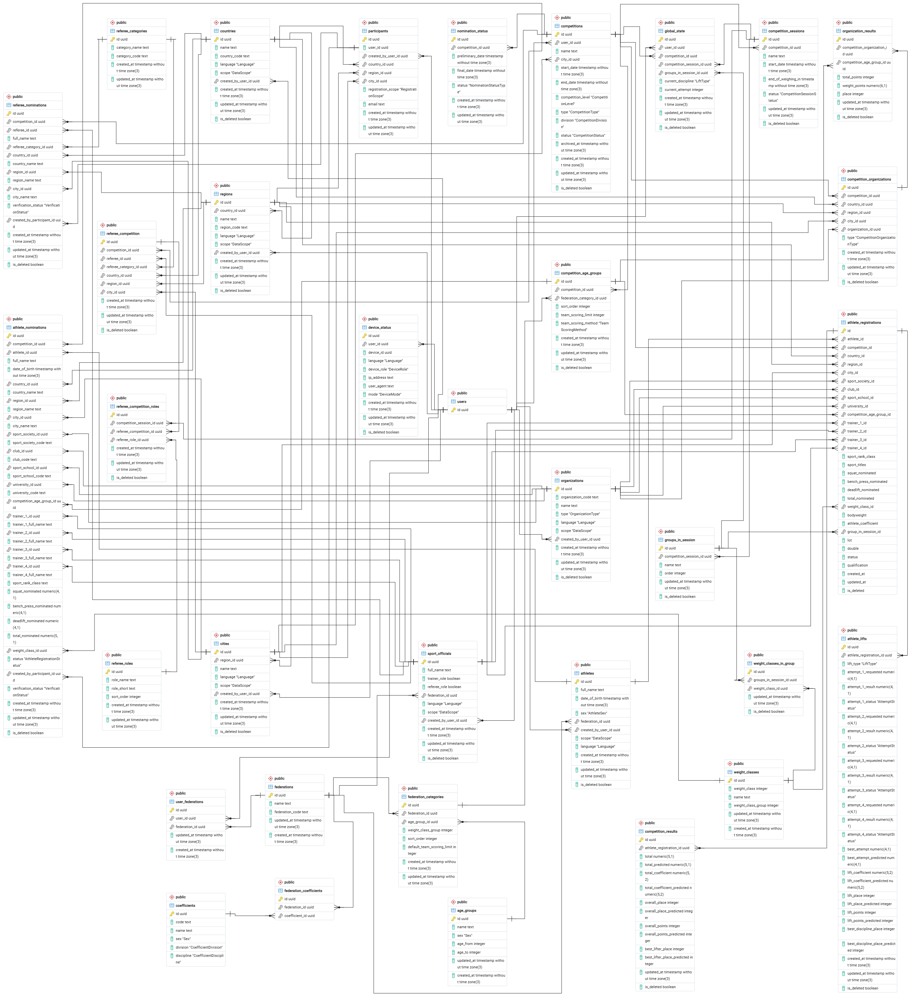

### Browser Database
The browser database is a local `PGlite` database used by the offline competition runtime.  
The database is managed by [PgliteService](#pgliteservice), which handles database initialization, migrations, and `SQL` query execution.

#### ER Diagram

#### Tables
**Some tables differ from the server database. Browser-specific differences are described in the corresponding table documentation.**  

The following tables are available in the browser database:

- **Reference Tables**
  - Static Reference Tables
    - [federations](database/reference.md#federations)
    - [coefficients](database/reference.md#coefficients)
    - [federation_coefficients](database/reference.md#federation_coefficients)
    - [age_groups](database/reference.md#age_groups)
    - [weight_classes](database/reference.md#weight_classes)
    - [federation_categories](database/reference.md#federation_categories)
    - [referee_categories](database/reference.md#referee_categories)
    - [referee_roles](database/reference.md#referee_roles)
  - User Reference Tables
    - [countries](database/reference.md#countries)
    - [regions](database/reference.md#regions)
    - [cities](database/reference.md#cities)
    - [organizations](database/reference.md#organizations)
    - [athletes](database/reference.md#athletes)
    - [sport_officials](database/reference.md#sport_officials)
    - [user_federations](database/reference.md#user_federations)

- **Configuration Tables**
  - [competition_age_groups](database/configuration.md#competition_age_groups)
  - [nomination_status](database/configuration.md#nomination_status)
  - [competition_sessions](database/configuration.md#competition_sessions)
  - [groups_in_session](database/configuration.md#groups_in_session)
  - [weight_classes_in_group](database/configuration.md#weight_classes_in_group)
  - [referee_competition](database/configuration.md#referee_competition)
  - [referee_nominations](database/configuration.md#referee_nominations)
  - [referee_competition_roles](database/configuration.md#referee_competition_roles)

- **Business Data Tables (User Data)**
  - [users](#users) (Differs from the server database. Server-specific authentication fields are not stored.)
  - [participants](database/user.md#participants) (The browser table does not define a foreign key between `participants.user_id` and `users.id`.)

- **Business Data Tables (Competition Data)**
  - [competitions](database/competition.md#competitions)
  - [athlete_registrations](database/competition.md#athlete_registrations)
  - [athlete_nominations](database/competition.md#athlete_nominations)
  - [competition_organizations](database/competition.md#competition_organizations)

- **Competition Runtime Tables**
  - [athlete_lifts](database/competition_runtime.md#athlete_lifts)
  - [competition_results](database/competition_runtime.md#competition_results)

- **Calculated Tables**
  - [organization_results](database/calculated.md)

- **System Runtime Tables**
  - [device_status](database/system_runtime.md#device_status)
  - [global_state](database/system_runtime.md#global_state)
 
- **Management Tables**
  - [sync_queue](#sync_queue)

> Note: The following server tables are not included in the browser database:
> - `installations`
> - `runtime_versions`

---

#### users
Only the following columns are stored locally:

| Column | Type |
|---|---|
| id | UUID |

Server-specific authentication fields are not stored in the browser database.

---

#### sync_queue
Stores local changes that are waiting to be synchronized with the backend.
* `id` — unique identifier of the synchronization operation.
* `source_id` — identifier of the device that created the operation.
* `operation_id` — identifier of the SQL operation that must be executed. The corresponding SQL statement is defined in the shared SQL layer.
* `record_id` — identifier of the affected record.
* `payload` — data required to execute the operation.
* `created_at` — timestamp when the operation was added to the queue.
* `processed_at` — timestamp when the operation was successfully processed.

The `Runtime` adds changes to `sync_queue` instead of scanning application tables for pending records. During synchronization, queued operations are sent to the backend for processing.

#### Synchronization flow
<pre>
Runtime
   │
   │  create change
   ▼
sync_queue
   │
   │  synchronization
   ▼
Backend API
   │
   ▼
sync_inbox
   │
   │  operation_id
   ▼
shared SQL
   │
   ▼
PostgreSQL
</pre>

---

### PgliteService
Manages the local `PGlite` database lifecycle and provides a centralized interface for database access.
* initializes the `PGlite` database in `IndexedDB`;
* creates and maintains the `__migrations` table;
* executes pending `SQL` migrations;
* tracks applied migrations;
* exposes the database instance through the `database` getter;
* provides a generic `query()` method for executing SQL statements.

The service is located in the `database/` directory and is used by `Runtime` services that work directly with the local database.  
The database migrations are defined in [pglite.config.ts](https://github.com/valeriinikolaichuk/powerlifting_competition_platform/blob/main/runtime/src/app/database/services/pglite.config.ts) and executed by `PgliteService` during database initialization.
